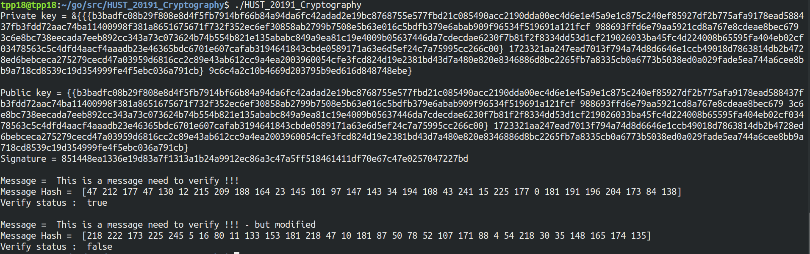

# DSA example
## Môi trường : 
_ Ngôn ngữ : **Go**

_ Thư viện của Go sử dụng : 
```go
"crypto/dsa"
"crypto/rand"
"crypto/sha256"
"fmt"
"hash"
"io"
"math/big"
"os"
```
____________________

## Mô tả chương trình :
_ Khởi tạo các tham số cho thuật toán DSA
```go 
func GenerateParameters(params *Parameters, rand io.Reader, sizes ParameterSizes) error {}
```
_ Sinh ra 2 cặp khóa private và public 
```go
privateKey := new(dsa.PrivateKey)
privateKey.PublicKey.Parameters = *params
dsa.GenerateKey(privateKey, rand.Reader) //Sinh cả 2 khóa 
```
_ Lựa chọn hàm hash : SHA-256
```go
var h hash.Hash
h = sha256.New()
```
_ Hash tin nhắn : 
```go
message := "This is a message need to verify !!!"
io.WriteString(h, message)
signHash := h.Sum(nil)
```
_ Ký tin nhắn :
- tham số truyền vào : 1 số int xác định entropy, private key, tin nhắn
- kết quả trả về : 2 số dạng *big int* và *error*
```go
r, s, err := dsa.Sign(rand.Reader, privateKey, signHash)
```
_ Xác nhận chữ ký : 
```go
verifyStatus := dsa.Verify(&publicKey, signHash, r, s)
```
_________________________________
## Hình ảnh khi chạy chương trình

