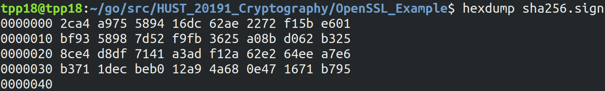

# Digital Signature with OpenSSL 
____________________________
## Tạo file chứa private key và public key 
_ Tạo khóa bí mật độ dài 512 bit bằng RSA lưu vào **myprivate.pem** : 
```bash
openssl genrsa -out myprivate.pem 512
```
_ Tách khóa công khai từ khóa bí mật lưu vào **mypublic.pem** :
```bash
openssl rsa -in myprivate.pem -pubout > mypublic.pem
``` 
_________________
## Ký văn bản
_ Thuật toán mã hóa : **SHA-256**

_ Padding Schema (Phương pháp thêm thông tin để đủ độ dài mã hóa) : **PCKS#1 v1.5**

_ Tạo 1 file chứa toàn bộ bảng chữ cái : 
```bash
echo abcdefghijklmnopqrstuvwxyz > myfile.txt
```
_ Ký văn bản vừa tạo sử dụng khóa bí mật : 
```bash
openssl dgst -sha256 -sign myprivate.pem -out sha256.sign myfile.txt 
```
_ Đọc văn bản đã ký (dạng Hex) : 

__________
## Xác thực chữ ký
_ Tham số đầu vào : 
+ Chữ ký : **sha256.sign**
+ Khóa công khai : **mypublic.pem**
+ Văn bản : **myfile.txt**
```bash
openssl dgst -sha256 -verify mypublic.pem -signature sha256.sign myfile.txt
```
_ Kết quả trả về 
+ Xác thực đúng : 
```bash
Verified OK
```
+ Xác thực sai : 
```bash
Verification Failure
```
