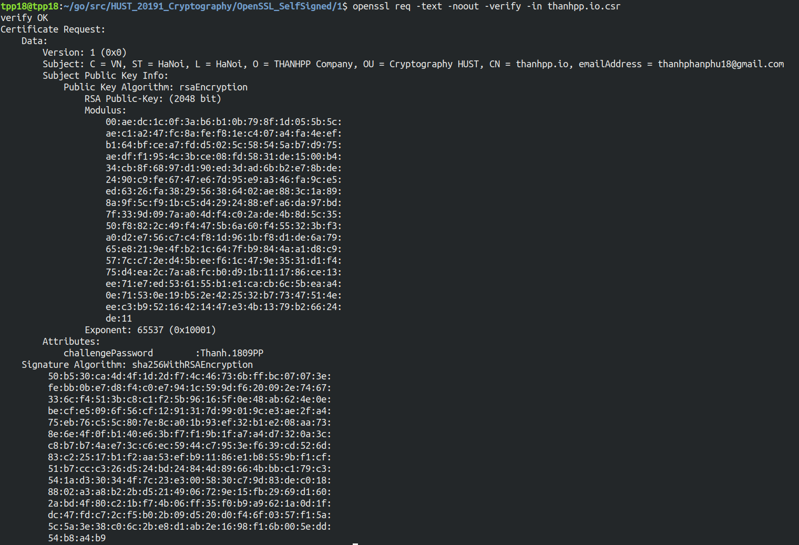
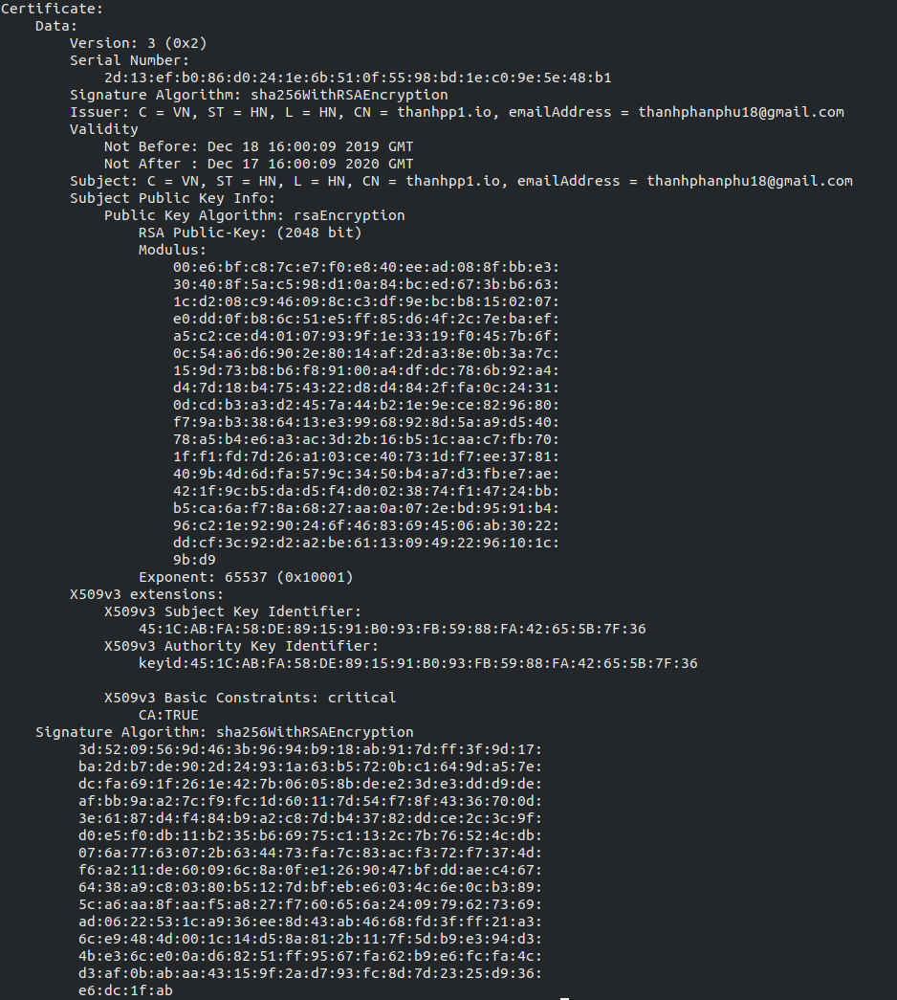
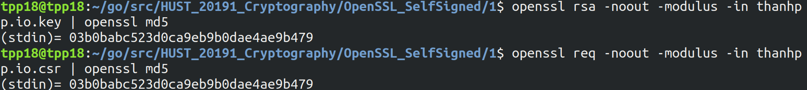
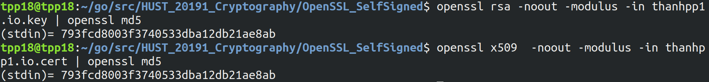

# Self signed Digital signature with OpenSSL

## 1. Yêu cầu cấp chứng thư số  : 

CSR : certificate signing request

CSR là yêu cầu bắt buộc để được cấp phát 1 chứng thư SSL từ CA (Certificate Authority - Cơ quan cấp chứng thư)

CSR sẽ bao gồm các thông tin liên quan đến chứng chỉ : 
-  Thông tin này được gọi là "Distinguised Name (DN)" : **Tên phân biệt**
- Một trường quan trọng trong DN là  "Common Name (CN)" : **Tên thường gọi**
- **Tên thường gọi** là tên miền đủ điều kiện (Fully Qualified Domain Name ) chính xác của máy chủ mà người sử dụng muốn dùng chứng thư số.
- Trong **Tên phân biệt** dành cho doanh nghiệp và tổ chức thường cần thêm các trường thông tin về chủ sở hữu.
```shell
Country Name (2 letter code) [AU]:
State or Province Name (full name) [Some-State]:
Locality Name (eg, city) []:
Organization Name (eg, company) [Internet Widgits Pty Ltd]:
Organizational Unit Name (eg, section) []:
Common Name (e.g. server FQDN or YOUR name) []:
Email Address []:

Please enter the following 'extra' attributes
to be sent with your certificate request
A challenge password []:
An optional company name []:
```
____________________
## 2. Tạo yêu cầu cấp chứng thư số :
### 2.1. Tạo khóa bí mật và yêu cầu cấp chứng thứ số : (folder 1)
Dùng cho việc triển khai giao thức HTTPS và yêu cầu cơ quan cấp chứng thư xác thực cho chứng thư SSL.

Sử dụng OpenSSL 
```bash
openssl req \
> -newkey rsa:2048 -nodes -keyout thanhpp.io.key \
> -out thanhpp.io.csr
```
Tạo ra 
- khóa bí mật : 2048 bit
- Yêu cầu cấp chứng thư số


### 2.2. Tạo chứng thư số SSL : 
Tạo ra chứng thư số  SSL mà không cần CA ký 
- Người sử dụng sẽ được thông báo là chứng thư không được tin tưởng
- Thường dùng cho các trao đôỉ không cần đến chứng minh danh tính của dịch vụ cho người sử dụng

```bash
openssl req \
> -newkey rsa:2048 -nodes -keyout thanhpp1.io.key \
> -x509 -days 365 -out thanhpp1.io.cert
# -x509 : cho thấy tạo ra chứng thư tự ký
# -days 365 : cho biết chứng thư sẽ có hiệu lực trong 365 ngày
```

______________
# 3. Xem các thông tin trong chứng thư :
## 3.1. Xem các thông tin trong yêu cầu cấp chứng thư số : 
```bash
openssl req -text -noout -verify -in thanhpp.io.csr
```
Cho phép xác thực và xem các thông tin trong chứng thư dưới dạng văn bản có thể đọc



## 3.2. Xem thông tin trong chứng thư số :
```bash
openssl x509 -text -noout -in thanhpp1.io.cert 
```



## 3.3 Kiểm tra khóa bí mật có khớp với CSR và CRT :
### 3.3.1. Với CSR : 
```bash
openssl rsa -noout -modulus -in thanhpp.io.key | openssl md5
openssl req -noout -modulus -in thanhpp.io.csr | openssl md5
```
Kết quả trùng nhau cho thấy khóa bí mật và csr khớp



### 3.3.2. Với cert : 
```bash
openssl rsa -noout -modulus -in thanhpp1.io.key | openssl md5
openssl x509  -noout -modulus -in thanhpp1.io.cert | openssl md5
```
Kết quả trùng nhau cho thấy khóa bí mật và csr khớp

